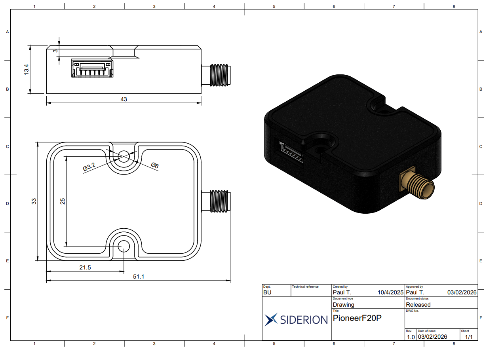
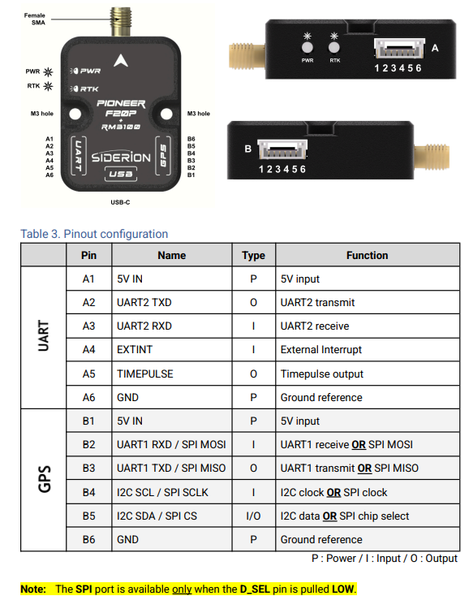
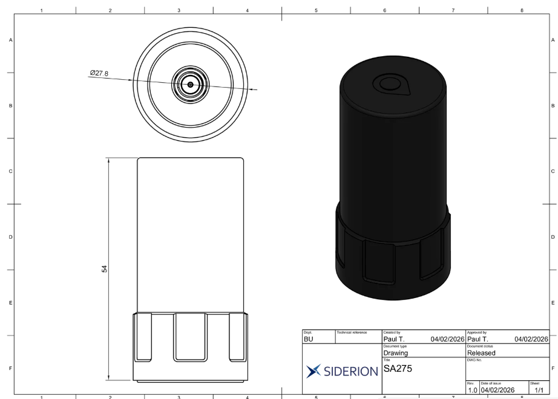

# Mécanisme de communication et processus du GPS Pioneer F20P



**NB :** Mes mesures physiques du module donnent environ **43,2 mm × 33,1 mm × 13,5 mm**. Ces valeurs peuvent légèrement différer des dimensions constructeur, car elles dépendent de la méthode de mesure utilisée.

## Présentation générale

Le **Pioneer F20P** est un module **GNSS RTK haute précision** destiné notamment aux drones, aux véhicules au sol, aux bases RTK et aux systèmes de navigation précise.

Son rôle principal est de transmettre au contrôleur de vol la **position globale du drone** sur le globe terrestre. Cette position peut ensuite être utilisée pour la navigation, le retour automatique à la base, le suivi de trajectoire ou encore l’estimation de la position d’un objet détecté au sol.

Le Pioneer F20P est basé sur le module **u-blox ZED-F20P**. Il est compatible avec les bandes GNSS **L1, L2 et L5**. Il peut recevoir plusieurs constellations satellites, notamment :

* **GPS**, système américain ;
* **Galileo**, système européen ;
* **BeiDou**, système chinois ;
* **QZSS**, système japonais ;
* **NavIC**, système indien.

L’utilisation de plusieurs constellations permet d’augmenter le nombre de satellites visibles. Cela améliore la disponibilité du signal, la stabilité du positionnement et la précision de la position.

En mode GNSS classique, la précision est généralement de l’ordre du mètre. En mode **RTK Fixed**, lorsque les corrections RTK sont correctement reçues, la précision peut atteindre le niveau centimétrique dans de bonnes conditions.

## Signification des LEDs

Le Pioneer F20P possède principalement deux LEDs :

* une LED **Power** de couleur bleue ;
* une LED **RTK Status** de couleur verte.

La LED **Power** bleue indique que le module est correctement alimenté.

La LED **RTK Status** verte indique l’état de la position GNSS/RTK :

* **3D fix / No RTK fix** : le module possède une position GNSS, mais il n’utilise pas encore de correction RTK ;
* **RTK fix but no FIXED RTK fix** : le module reçoit des corrections RTK, mais la précision maximale n’est pas encore verrouillée ;
* **FIXED RTK fix** : le RTK est fixé. C’est l’état le plus précis, permettant d’obtenir une position de l’ordre du centimètre dans de bonnes conditions.

Pour notre projet, l’état le plus intéressant est donc **FIXED RTK fix**, car il permet d’obtenir une position beaucoup plus précise qu’un GPS classique.

## Explication du RTK

Le **RTK**, pour **Real-Time Kinematic**, est une technique qui permet d’améliorer la précision d’une position GNSS grâce à des corrections envoyées en temps réel.

Le principe repose principalement sur deux éléments :

1. une **station de base RTK**, placée au sol et immobile ;
2. un **rover RTK**, ici le Pioneer F20P embarqué sur le drone.

La station de base RTK connaît précisément sa position, ou la détermine à l’aide d’une procédure appelée **survey-in**. Elle compare sa position connue avec la position calculée à partir des signaux satellites. À partir de cette différence, elle génère des corrections, généralement au format **RTCM**.

Ces corrections sont ensuite transmises au rover, c’est-à-dire au GPS embarqué sur le drone. Le Pioneer F20P utilise alors ces corrections pour améliorer fortement la précision de sa position.

Ce mécanisme permet d’obtenir une précision beaucoup plus élevée qu’un GPS classique.

Dans notre cas, trois solutions principales s’offrent à nous pour utiliser le RTK avec le Pioneer F20P :

1. **L’utilisation d’une station de base RTK mobile**
   Il s’agit d’une base transportable que l’on installe temporairement sur le terrain. Elle doit rester immobile pendant l’utilisation.

2. **L’utilisation d’une station de base RTK fixe**
   Il s’agit d’une base installée à un emplacement connu et permanent. C’est une solution plus stable, mais moins flexible.

3. **L’utilisation d’un service NTRIP**
   Le service NTRIP fournit les corrections RTK via Internet. Dans ce cas, il n’est pas forcément nécessaire d’avoir sa propre station de base sur le terrain, mais il faut une connexion réseau fiable.

Dans tous les cas, le Pioneer F20P embarqué sur le drone joue le rôle de **rover RTK**. Il reçoit les corrections provenant de la base RTK ou du service NTRIP afin d’améliorer la précision de sa position.

## Fonctionnement multi-constellations sans RTK

Le Pioneer F20P peut utiliser automatiquement plusieurs constellations GNSS visibles dans le ciel.

L’objectif est d’exploiter un maximum de satellites disponibles afin d’améliorer :

* la précision de la position ;
* la stabilité du positionnement ;
* le temps d’acquisition du signal ;
* la robustesse dans les environnements difficiles.

Il n’est généralement pas nécessaire de choisir manuellement une constellation précise. Dans un usage classique avec un contrôleur de vol, le module sélectionne automatiquement les signaux utiles parmi les constellations activées.

Il est toutefois possible de modifier certaines configurations avec des outils avancés, par exemple pour activer ou désactiver certaines constellations. Cependant, pour une première intégration avec un drone, la configuration automatique est généralement suffisante.

## Mécanisme d’intégration

Le Pioneer F20P possède plusieurs interfaces de communication :

* **UART** ;
* **I2C** ;
* **SPI** ;
* **USB-C**.



Les deux connecteurs latéraux principaux sont :

* le connecteur **UART** ;
* le connecteur **GPS**.

Ces deux connecteurs permettent de communiquer avec le module, mais ils n’ont pas exactement le même rôle.

## 1. Utilisation du connecteur UART

Le connecteur **UART** permet d’utiliser l’interface **UART2** du Pioneer F20P.

Il peut servir à tester le GPS avec :

* un Arduino ;
* une Raspberry Pi ;
* un microcontrôleur ;
* un ordinateur via un adaptateur USB-série ;
* ou un autre système embarqué.

Le branchement de base est le suivant :

```text
Pioneer F20P 5V  →  5V du système
Pioneer F20P GND →  GND du système
Pioneer F20P TX  →  RX du système
Pioneer F20P RX  →  TX du système
```

Il faut toujours croiser les lignes série :

```text
TX du GPS → RX du contrôleur
RX du GPS → TX du contrôleur
```

Ce connecteur est donc pratique pour effectuer un premier test de communication et vérifier que le GPS transmet bien des données.

## 2. Utilisation du connecteur GPS

Le connecteur **GPS** est plutôt destiné à l’intégration avec un contrôleur de vol, par exemple un contrôleur compatible **ArduPilot**, **Pixhawk** ou équivalent.

Ce connecteur expose principalement :

* l’alimentation **5 V** ;
* la masse **GND** ;
* l’interface **UART1** pour les données GNSS ;
* l’interface **I2C** pour certains capteurs internes comme le compas ou le baromètre.

Le branchement de base avec un contrôleur de vol est le suivant :

```text
Pioneer F20P B1 5V       →  5V du contrôleur de vol
Pioneer F20P B6 GND      →  GND du contrôleur de vol
Pioneer F20P B3 UART1 TX →  RX du contrôleur de vol
Pioneer F20P B2 UART1 RX →  TX du contrôleur de vol
Pioneer F20P B4 I2C SCL  →  SCL du contrôleur de vol, si utilisé
Pioneer F20P B5 I2C SDA  →  SDA du contrôleur de vol, si utilisé
```

En mode normal, le connecteur GPS fonctionne en **UART + I2C**.

L’UART permet de transmettre les données principales du GNSS, comme la latitude, la longitude, l’altitude, la vitesse, le nombre de satellites ou encore l’état du fix.

L’I2C peut être utilisé pour communiquer avec certains capteurs internes, comme le compas ou le baromètre, si le contrôleur de vol les prend en charge.

## Remarque importante sur D_SEL

La broche **D_SEL** ne doit pas être mise à LOW pour une utilisation classique du connecteur GPS en mode UART/I2C.

La documentation précise que le mode **SPI** est disponible uniquement lorsque **D_SEL est tiré à LOW**, c’est-à-dire relié à la masse.

Donc :

```text
D_SEL non relié à GND → mode normal UART + I2C
D_SEL relié à GND    → mode SPI
```

Pour une première intégration avec un contrôleur de vol, il est préférable d’utiliser le mode normal **UART + I2C**. Le mode SPI est plus spécifique et n’est pas nécessaire dans notre cas.

## Configuration du GPS dans ArduPilot

Pour utiliser le Pioneer F20P avec ArduPilot, il faut connecter le module à un port série disponible du contrôleur de vol, puis configurer ce port comme port GPS.

Les paramètres principaux à vérifier sont :

* le port série utilisé ;
* le baudrate ;
* le type de GPS ;
* la bonne réception des données GNSS ;
* l’activation éventuelle du RTK ;
* la réception des corrections RTK si l’on souhaite obtenir le mode **RTK Fixed**.

Pour obtenir une précision élevée, il est recommandé d’utiliser le RTK avec une station de base ou un service NTRIP.

Sans correction RTK, le Pioneer F20P fonctionne comme un GNSS classique multi-constellations. Avec les corrections RTK, il peut atteindre une précision bien plus élevée, adaptée aux applications de navigation précise.

## Sources utilisées

### Documentation technique du Pioneer F20P

Source : [Siderion Pioneer F20P Datasheet](SiderionDoc_PioneerF20P.pdf)

Cette documentation a été utilisée pour comprendre :

* les dimensions constructeur du module ;
* les interfaces disponibles : UART, GPS, I2C, SPI et USB-C ;
* la signification des LEDs Power et RTK Status ;
* les broches des connecteurs UART, GPS, P1 et P2 ;
* les caractéristiques du module u-blox ZED-F20P ;
* la présence du compas RM3100 et du baromètre BMP581 ;
* les performances GNSS et RTK du module.

### Source vidéo utilisée pour la compréhension du RTK

Source : [Vidéo explicative sur l’usage du RTK en agriculture](https://www.youtube.com/watch?v=kWkX3LLpdEE)

Cette vidéo a été utilisée pour comprendre le principe général du RTK dans un cas concret d’usage terrain, notamment dans le domaine agricole.

### Source vidéo utilisée pour la configuration ArduPilot

Source : [Tutoriel de configuration GPS / RTK sur ArduPilot](https://www.youtube.com/watch?v=vCMOT1l-gew&list=PLYsWjANuAm4qmQ9uAZOuU9C1TR9gtxU04&index=2)

Cette vidéo a été utilisée pour comprendre la démarche générale de configuration d’un GPS RTK avec un contrôleur de vol et une station sol.

### Mesures personnelles

Les mesures physiques du module indiquées dans ce rapport proviennent de mes propres mesures réalisées sur le Pioneer F20P :

```text
43,2 mm × 33,1 mm × 13,5 mm
```

Ces valeurs sont donc indiquées comme mesures personnelles et peuvent légèrement différer des dimensions constructeur.


## Antenne associée au Pioneer F20P

Pour fonctionner correctement, le Pioneer F20P doit être utilisé avec une antenne GNSS adaptée. Dans notre cas, le module peut être couplé à l’antenne multibande **SA275**, compatible avec les signaux GNSS utilisés par le module.

Source : [SA275 Multiband RTK GNSS Antenna](https://siderion.io/fr/products/sa275-multiband-rtk-gnss-antenna?pr_prod_strat=pinned&pr_rec_id=cbb398738&pr_rec_pid=10549291188551&pr_ref_pid=10549270413639&pr_seq=uniform)

D’après la fiche produit, l’antenne possède un diamètre d’environ **27,8 mm** pour une hauteur d’environ **54 mm** de 16g environ.


